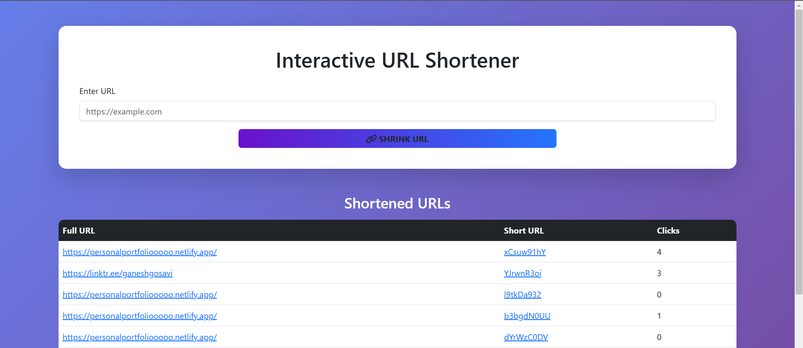

# URL Shortener 🚀

A simple and interactive URL shortener built with **Node.js**, **Express**, **MongoDB**, and **EJS**. This application allows users to shorten long URLs, track usage statistics, and redirect users from short URLs to the original ones.

## Features 🌟
**Deployed Link** :https://url-shortener-pv25.onrender.com/

- **🔗 Shorten URLs**: Quickly shorten long URLs into short, shareable links.
- **↗️ Redirection**: Redirects users to the original URL when visiting the shortened URL.
- **📊 Usage Statistics**: Tracks the number of clicks on each shortened URL and records the last accessed time.
- **⚡ Rate Limiting**: Restrict the number of requests per minute per client (100 requests/minute by default).
- **🎨 Responsive UI**: Interactive and mobile-friendly UI built with **Bootstrap**.

## Tech Stack 💻

- **Node.js**: JavaScript runtime for building the backend API.
- **Express.js**: Web framework for Node.js to create routes and handle requests.
- **MongoDB**: NoSQL database for storing URLs and usage statistics.
- **EJS**: Templating engine for rendering HTML views.
- **Validator.js**: For URL validation to ensure only valid URLs are accepted.
- **Express-rate-limit**: Middleware to apply rate limiting (optional feature).
- **Bootstrap**: Frontend framework for building a responsive design.

## Prerequisites 🔧

Before running the project, make sure you have the following installed:

- **Node.js**: [Download Node.js](https://nodejs.org/)
- **MongoDB**: [Download MongoDB](https://www.mongodb.com/try/download/community) or use [MongoDB Atlas](https://www.mongodb.com/cloud/atlas) for cloud-based MongoDB service.

## Installation 🛠️

1. **Clone the repository**:

    ```bash
    git clone https://github.com/your-username/url-shortener.git
    cd url-shortener
    ```

2. **Install dependencies**:

    Install the required Node.js modules:

    ```bash
    npm install
    ```

3. **Set up environment variables**:

    Create a `.env` file in the root of your project and add the following:

    ```bash
    MONGO_URI=mongodb://localhost:27017/urlshortener
    PORT=5000
    ```

    - Replace `MONGO_URI` with your MongoDB URI if using MongoDB Atlas.

4. **Start the server**:

    Run the application:

    ```bash
    npm start
    ```

    The server will start on [http://localhost:5000](http://localhost:5000).

## Usage 🚀

1. Open your browser and navigate to [http://localhost:5000](http://localhost:5000).
2. On the homepage, input a URL you want to shorten in the provided form and click **Shrink URL**.
3. The shortened URL will appear below, along with the number of clicks.
4. You can click on the shortened URL to be redirected to the original URL.

## Images 📸

Here are some screenshots of the UI:

 
*Example of the list displaying shortened URLs and their click counts.*

> You can replace the URLs above with the actual links to your screenshots. If the images are in your local repository, you can store them in a folder like `assets` or `images` and use relative paths, like `./images/screenshot1.png`.

## Contributing 🤝

We welcome contributions to this project! If you'd like to help improve it, feel free to fork the repository and submit a pull request. Please ensure that your changes align with the project’s coding standards.

1. Fork the repository.
2. Create a new branch: `git checkout -b feature-name`.
3. Make your changes.
4. Commit your changes: `git commit -am 'Add new feature'`.
5. Push to the branch: `git push origin feature-name`.
6. Open a pull request.

## License 📄

This project is licensed under the **MIT License** - see the [LICENSE](LICENSE) file for details.

---

### Connect with me! 💬

- [GitHub](https://github.com/Ganesh-Gosavi)
- [LinkedIn](https://www.linkedin.com/in/ganesh-gosavi-6856b1230/)
- [Twitter](https://twitter.com/ganeshgosavi95697)

---

Made with ❤️ by **Ganesh Gosavi**
